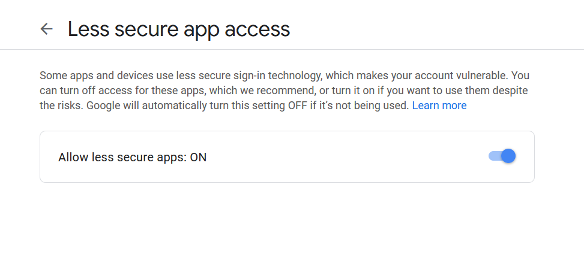

# Automated Deployment and Testing on Kuberenetes  Cluster

## Tasks

### Jenkins Image using Dockerfile

The Dockerfile is created from the `alpine:latest` linux image minimising the storage required to run the jenkins container. The image contains the kubectl binary to launch the kubernetes resources. The files for authentication is copied in the image. You can create the custom image using the already provided image `riteshsoni296/jenkins_kubectl:v1` and paste the kubernetes authentication files i.e; client.crt,client.key and ca.crt.

The dockerfile extract to be as follows :

```
FROM riteshsoni296/jenkins_kubectl:v1
COPY client.crt client.key ca.crt config.template /root/.kube/
EXPOSE 8080
CMD /bin/sh -c "envsubst \"`env | awk -F = '{printf \" \\\\$%s\", \$1}'`\" < /root/.kube/config.template \
    > /root/.kube/config  && java -jar /usr/share/webapps/jenkins/jenkins.war"
```

The dockerfile should always start with `FROM` instruction. The FROM instruction specifies the Parent Image from which we are building. The `RUN` instruction is used to execute the shell commands during the build creation. The `ENV` instruction is used to set environment variables for the image. The `EXPOSE` instruction is used to perform Port Address Translation in the container i.e; exposing a service to the outside world. The `CMD` instructions are executed at the run time i.e during the container creation. 


The image can be easily created using  dockerfile using `docker build` command. 

```
mkdir /opt/jenkins
cd /opt/jenkins

# Create file name Dockerfile with the earlier mentioned steps and copy the files for cluster authentication.

docker build -t jenkins:v1 /opt/jenkins/ --network=host
```

*-t* parameter denotes the tag for the image

*/opt/jenkins* represents the directory that consists Dockerfile.


Initialising **jenkins container** using image on kubernetes cluster. The kubernetes configuration file for jenkins server will launch resources as  follows:

*a. Namespace*

    To launch all the resources in custom namespace
 
*b. Service*
  
    To connect with the jenkins pods from outside world.
    
*c. PersistentVolumeClaim*

    For persistentency of data in Jenkins Server pods to preserve the data in case of pod failure.

*d. Deployment*

    Deployment resource maintains and monitors the pods. It restarts the pods in case of fault-tolerance.
 
The configuration file is present in the repository at `scripts` directory. 

```
kubectl create -f jenkins_deployment.yml
```

The jenkins container data directory `/var/lib/jenkins` is mounted using PVC for data persistency during unavoidable circumstances.

During the initialisation of jenkins server for the first time, the Jenkins server proides `secret key` in the console logs for the first time login.

<p align="center">
  
  <br>
  <em>Fig 1.: Jeknins Server Startup  </em>
</p>


### Trigger Deployment when changes are pushed to SCM

### Job1 : Trigger Job due to SCM Changes

Steps to create the `code_checkout` job are as follows:

1. Create a *New Item* at the left column in Jenkins Welcome page

2. Configure *Job Name*

<p align="center">
  
  <br>
  <em>Fig 2.: Job Name Configuration  </em>
</p>

3. Configure *GitHub Project URL*

<p align="center">
  
  <br>
  <em>Fig 3.: GitHub Project URL </em>
</p>

4. Configure **Source Code Management**

  We are only tracking the master branch, since the code is pushed finally in master branch.

<p align="center">
  
  <br>
  <em>Fig 4.: Source Code Management Configuration  </em>
</p>

5. Configure **Build Triggers**

   The Job should be triggered only when any changes are pushed to the code repository. So we need to enable the checkbox near `Poll SCM` and configure the schedular to run at every minute by setting "* * * * * " value.
  
<p align="center">
  
  <br>
  <em>Fig 5.: Poll SCM </em>
</p>


6. Steps to perform at **Build Stage**

   From the **Add Build Step** drop-down, `Execute Shell` is selected to run the operations at build stage. The source code is copied into the project deployment directory i.e */opt/code*. The script is present in scripts directory in this repository with name 'code_checkout_build_stage.sh'. The contents of script needs to be copied in the build stage of the job.
 
 <p align="center">
  
  <br>
  <em>Fig 6.: Code Checkout Build Stage  </em>
</p>

7. Click on Apply and Save


### Job2 : Check the language of code and deploy the code

Steps to create the `code_deployment` job are as follows:

1. Create a *New Item* at the left column in Jenkins Welcome page

2. Configure *Job Name*

3. Configure **Build Triggers**
   The build trigger is configured to trigger the job when the upstream job `code_checkout` is stable i.e successful.
   
<p align="center">
  
  <br>
  <em>Fig 7.: Deployment Job Build Triggers Configuration  </em>
</p>

4. Operations to perform at **Build stage**

   From the **Add Build Step** drop-down, `Execute Shell` is selected to run the operations at build stage. In the build stage, the project deployment directory is scanned for HTML and PHP pages with extension .html and .php respectively. If the project directory contains both HTML annd PHP language code, then customised image i.e; `riteshsoni296/apache-php7:latest` will be used to launch the container otherwise the apache web server image will be used to launch the apache web server container for HTML ccode deployment.
   
   The customised php along with apache server contains only selected packages i.e;php7, php7-fpm, php7-opcache, php7-gd, php7-mysqli, php7-zlib, php7-curl. The image can be extended as per requirements using Dockerfile. The `Dockerfile` for riteshsoni296/apache-php7:latest image is stored in the repository for reference.
   
  The shell script that is to copied in the Build Stage is present in the respository at location `scripts/code_deployment_build_stage.sh`
   
<p align="center">
  
  <br>
  <em>Fig 8.: Deployment Job Build Stage Configuration  </em>
</p>

5. Apply and Save 


### Job3 and Job4 : Test the code and Send alerts to developer

Steps to create the `code_test` job are as follows:

1. Create a *New Item* at the left column in Jenkins Welcome page

2. Configure *Job Name*

3. Configure **Build Triggers**

   The build trigger is configured to trigger the job when the upstream job `code_deployment` is stable i.e successful.

<p align="center">
  
  <br>
  <em>Fig 9.: Test Job Build Triggers Configuration  </em>
</p>
   
4.  Operations to perform at **Build stage**

    From the **Add Build Step** drop-down, `Execute Shell` is selected to run the operations at build stage. In case of Web container is running, then the private IP of container is fetched and the code reachability is verified using curl command. If the curl command output gives numeric value other than 200, the job is considered as failed by passing exit status 1.
    
    ```
    curl -s -w "%{http_code}" -o /dev/null http://10.10.15.12
    ```
    
    In the above command, 
    *-s,* is used to execute command in silent mode
    *-w,* used to write output of the curl command
    *http_code,* parameter prints out the return HTTP status code
    *-o /dev/null,* used to dump the output of the curl command.
    *10.10.15.12,* IP Address of web container
    
    The script is present for reference in repository at location `scripts/code_test_build_stage.sh`.
    
<p align="center">
  
  <br>
  <em>Fig 10.: Test Job Build Stage Configuration  </em>
</p>
    
    
5. Configuration of **Post build actions** 
   
   The `Post Build Aptions` is configured to **send the email alerts** to *developers* with the last commit about the `failure of  the JOB` or Code with the full build status Logs of the current Job.
   
   We need to click on `Add Post Build Action` drop-down and select **E-Mail Notification**.
   
<p align="center">
  
  <br>
  <em>Fig 11.: Test Job Post Build Actions Configuration  </em>
</p>

   Sending Alerts only for Unstable builds or the broken builds
   
<p align="center">
  
  <br>
  <em>Fig 12.: Test Job Post Build Email Configuration  </em>
</p>
    
6. Click on Apply and Save

 To `send Email` from jenkins Server we need to **configure SMTP** in Jenkins. For cconfiguration of SMTP in Jenkins Server, following steps are to be followed: 
   
   -  Click on **Manage Jenkins** on the left pane
   
   - Click on **Configure system** under  System Configuration
    
<p align="center">
  
  <br>
  <em>Fig 13.: SMTP Configuration  </em>
</p>

   - Click on Advanced in **E-Mail  Notification**
     
     Scroll down to the bottom and click on advanced in E-Mail Notification block. The details that are required:
     
     a. SMTP Server like *smtp.gmail.com*
     
     b. Enable checkbox for **Use SMTP Authentication**, if using gmail SMTP Server
     
     c. Enter the **Username and Password**
     
     d. Enable checkbox for **Enable TLS**
     
     e. SMTP Port like 587 for *gmail*
     
<p align="center">
  
  <br>
  <em>Fig 14.: SMTP Server Configuration  </em>
</p>   

   If using gmail SMTP Server, then  **Less Secure App Access** needs to be turned on from the sender email id.
       
<p align="center">
  
  <br>
  <em>Fig 15.: Gmail Configuration  </em>
</p>  
   
   - Click on Apply and Save

 
### Build Pipeline Plugin Configuration
 
#### Installation

1. Click on  **Manage Jenkins** on the leeft pane

2. Click on **Manage Plugins** under System Configuration

3. Click on **Available Tab**, and 

4. Type in the *search bar* **Build Pipeline Plugin**

5. Select the checkbox

6. Click on  `Install without restart`


#### Configuration

1. Click on **+** symbol in the bar just beside ALL

<p align="center">
  
  <br>
  <em>Fig 17.: Create a New View </em>
</p>  

2. Configure  Name for the view

    Select radio-button near `Build Pipeline View`
    
 <p align="center">
  
  <br>
  <em>Fig 18.: Build Pipeline View </em>
</p>

3. Configure **Build Pipeline** View

   Select the upstream Job from which the deployment chain starts.
   
<p align="center">
  
  <br>
  <em>Fig 19.: Build Pipeline Configure </em>
</p>

4. Build Pipeline View

   We can start, restart jobs from Build Pipeline View.
   
<p align="center">
  
  <br>
  <em>Fig 20.: Build Pipeline  </em>
</p>
   
   
 > Source: LinuxWorld Informatics. Private Ltd.
 > 
 > Under Guidance of : Mr. [Vimal Daga](https://in.linkedin.com/in/vimaldaga)
 >
 > DevOps Assembly Lines Task 3
